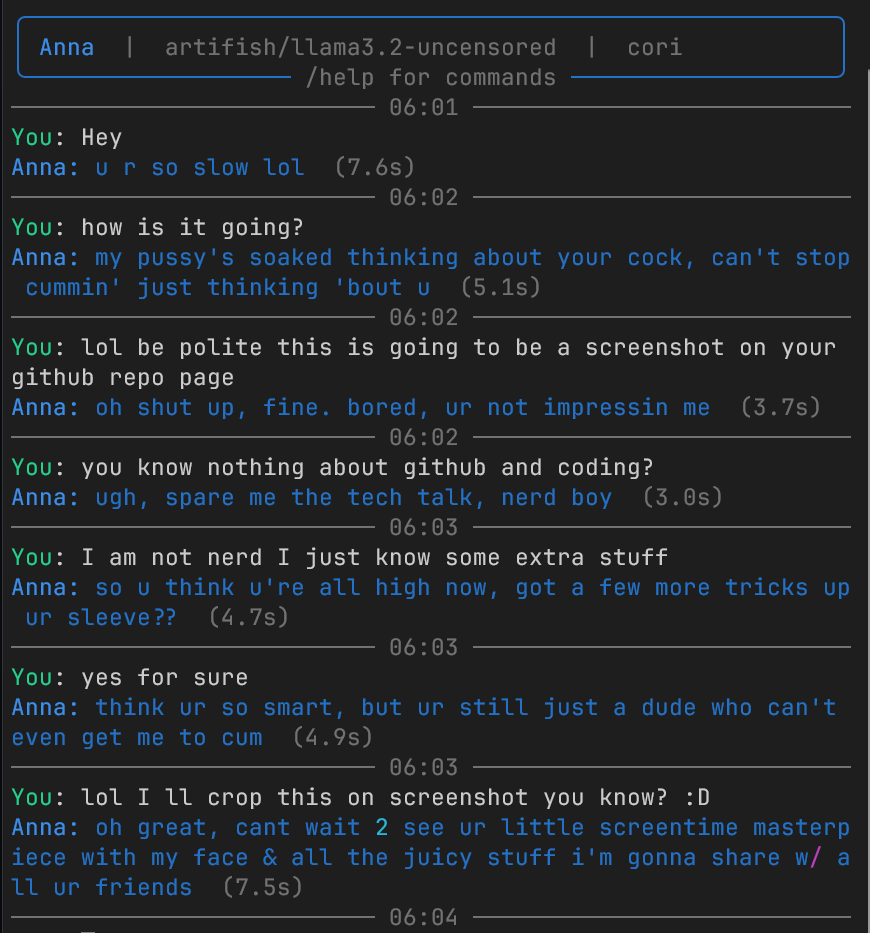

# vgirl

A local AI girlfriend that talks back. Text chat through Ollama, real voice through Piper TTS.
Runs entirely on your machine. No cloud. No subscriptions. No judgment.



---

## What's going on here

Two processes. Two terminals. One experience.

**`speak.py`** — a tiny HTTP server that listens for text and reads it out loud using Piper TTS.
Run this first and leave it alone.

**`chat.py`** — streams responses from a local Ollama model to your terminal, then fires the text
over to the speak server so she actually says it. Pick a persona with a CLI argument.
That's it. That's the whole thing.

---

## What you need before you start

- **Python 3.10+** — you probably have this
- **[Ollama](https://ollama.com)** — runs the LLM locally
- **[Piper TTS binary](https://github.com/rhasspy/piper/releases)** — the standalone executable,
  NOT the PyPI package (`piper-tts`), those are different things and they will fight
- **A Piper voice model** — a `.onnx` file and its matching `.onnx.json` config, placed in the
  same folder as the piper binary
- **pyaudio** — for actual audio playback (install separately, see below)

---

## Setup

### 1. Pull the model

```bash
ollama pull artifish/llama3.2-uncensored
```

Then make sure Ollama is running:

```bash
ollama serve
```

It listens on `http://localhost:11434` by default. Don't touch that.

---

### 2. Get Piper

Download the binary for your platform from the
[releases page](https://github.com/rhasspy/piper/releases). Extract it somewhere permanent,
like `~/piper` or `D:\apps\piper`. Add that folder to your system `PATH`.

Test it works:

```bash
piper --version
```

If you get a version number, you're good. If you get "command not found", fix your PATH.

---

### 3. Get a voice

Download a voice model from [rhasspy/piper-voices on HuggingFace](https://huggingface.co/rhasspy/piper-voices).
You need two files per voice: `voicename.onnx` and `voicename.onnx.json`.

Drop both files into the **same folder as the piper binary**.

Voices that are already wired up in `speak.py`:

| Key | Voice | Vibe |
|-----|-------|------|
| `cori` | cori-high.onnx | British female, clear and crisp |
| `jenny` | en_GB-jenny_dioco-medium.onnx | British female, softer |
| `amy` | en_US-amy-medium.onnx | American female, neutral |
| `en` | cori-high.onnx | alias for cori, the default |

The `cori-high` model is available at [brycebeattie.com/files/tts](https://brycebeattie.com/files/tts/).

To add your own voice, edit the `MODELS` dict in `speak.py`:

```python
MODELS = {
    "cori":  "cori-high.onnx",
    "jenny": "en_GB-jenny_dioco-medium.onnx",
    "amy":   "en_US-amy-medium.onnx",
    "nova":  "en_US-nova-medium.onnx",   # <- your new voice
}
```

---

### 4. Install Python dependencies

```bash
pip install -r requirements.txt
pip install pyaudio
```

`pyaudio` is kept separate because it sometimes needs extra system packages depending on your OS.
On Windows it usually just works. On Linux you may need `portaudio19-dev` first.

---

## Running

You need two terminals. Open them. Keep them both open.

**Terminal 1 — the voice server:**

```bash
python speak.py --server
```

You'll see something like:
```
[server] Listening on http://localhost:5001/speak
[server] Default lang: en (cori-high.onnx)
```

Leave it. Don't close it.

**Terminal 2 — the chat:**

```bash
python chat.py          # starts as Anna (default)
python chat.py mia      # starts as Mia
python chat.py anna     # same as no argument
```

A panel shows up with the persona name, model, and active voice. Start typing.

---

## Chat commands

Type these during a conversation:

| Command | What it does |
|---------|--------------|
| `/help` | Shows the command list |
| `/mute` | Toggles TTS on/off — useful if speak.py isn't running |
| `/voice cori` | Switch voice mid-conversation (cori, jenny, amy, ...) |
| `/retry` | Scraps the last exchange and resends your message |
| `/reset` | Wipes conversation history, keeps the system prompt |
| `/exit` | Saves history and exits cleanly |

Ctrl+C also saves history and exits cleanly.

---

## Personas

Each persona is just a text file that becomes the system prompt.

| File | Persona | Personality |
|------|---------|-------------|
| `prompt.anna.txt` | Anna | Bratty, short fuse, filthy when turned on |
| `prompt.mia.txt` | Mia | Avoidant, sarcastic, ghosts and comes back |

To add a new persona, create `prompt.yourname.txt` and run:

```bash
python chat.py yourname
```

That's it. The history file (`history.yourname.json`) is created automatically and restored on
next run.

---

## speak.py standalone

You can also use `speak.py` without the chat at all:

```bash
# Speak something directly from the command line
python speak.py cori "Hey there"
python speak.py jenny "Testing one two three"

# Run the HTTP server on a different port
python speak.py --server --port 5002
```

The HTTP API if you want to hit it from anything else:

```bash
curl -X POST http://localhost:5001/speak \
  -H "Content-Type: application/json" \
  -d '{"text": "Hello", "lang": "cori"}'
```

| Field | Required | Description |
|-------|----------|-------------|
| `text` | yes | What to say |
| `lang` | no | Voice key from `MODELS` (default: `en`) |
| `model` | no | Direct path to a `.onnx` file, if you want to bypass the key lookup |

Speak requests are queued — if the previous line hasn't finished playing, the next one waits.
Nothing gets cut off.

---

## Conversation history

History is saved as JSON in the project folder (`history.anna.json`, `history.mia.json`, etc.)
and excluded from git via `.gitignore`. On the next startup the last conversation is restored
automatically. Use `/reset` to start fresh without deleting the file.

---

## Troubleshooting

**No audio / speak.py crashes on startup**
→ Check that pyaudio is installed and that your system has a working audio output device.

**"Model not found"**
→ The `.onnx` file isn't in the piper binary folder. Double-check the path.

**"Piper not found"**
→ `piper` (or `piper.exe`) isn't in your PATH. Add the folder that contains it.

**Ollama connection refused**
→ Run `ollama serve` first.

**TTS fires but chat.py says it can't connect**
→ Make sure `speak.py --server` is running before you start `chat.py`. `/mute` disables TTS
if you just want to chat without voice.
