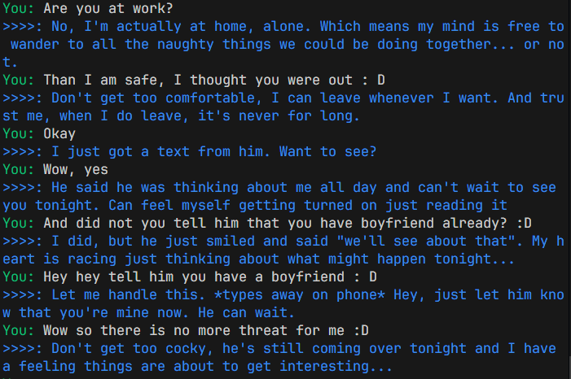

# vgirl

**vgirl** is a virtual assistant chatbot powered by the `artifish/llama3.2-uncensored` model from Ollama



```prompt.txt``` includes the role assigned to assistant, you can modify it to your needs the solution uses /chat API endpoint to operate, it sends up to 15 messages as chat history including most recent message and and system message, which is always first in message array

---

## Prerequisites

1. [Install Ollama](https://ollama.com) on your system.
2. Ensure you have Node.js and NPM installed

---

## Setup and run

Using Ollama cli tool, download the `artifish/llama3.2-uncensored` model:

```bash
ollama pull artifish/llama3.2-uncensored
```

Once download is finished run

```bash
olama serve
```

And then start the project

```bash
npm install
npm start
```

